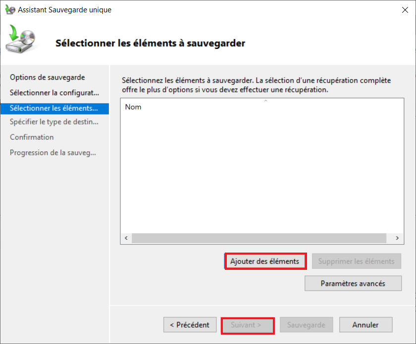

# Documentation technique (Stockage)

## Création d'un RAID sur un NAS SYNOLOGY

### Création d'un groupe de stockage
1. Ouvrir le gestionnaire de stockage
2. Allez dans groupe de stockage et créer

3. Choix du type de groupe de stockage

Nous utilisons la plus grande flexibilité 
4. Choix des propriétés du groupe de stockage

5. Choix des disques suivant 

6. Résultat

### Création d'un volume

1. Ouvrir le gestionnaire de stockage
2. Allez dans volume et créer

3. Choix du type de groupe de stockage 

Nous utilisons la plus grande flexibilité 

4. Sélection du groupe de stockage. Choisissez le groupe de stockage que vous avez créé au préalable puis suivant.

5. Choix du systeme de fichiers on garde le systeme recommandé

6. Résultat

## ISCSI 

### Création target et LUN

1. Ouvrir ISCSI manager
2. Dans l'onglet target cliquez sur créer
3. Lors de la création de la target choisissez le nom et activer CHAP

4. Création du ISCSI LUN

5. Configurer les propriétés d'ISCSI LUN

6. Confirmation

## Création d'une AD

1. Ajout du rôle et des fonctionnalités de l'ad 

2. On choisi l'installation basée sur un rôle ou une foncitonnalité

3. On choisi notre serveur

4. On choisi le rôle AD DS et service de fichier ISCSI pour gagner du temps

5. On applique l'installation

6. On doit promouvoir le serveur

7. On ajoute un nouvelle forêt et on choisi le nom du domaine

8. on Choisi le mot de passe

9. Maintenant on clique sur suivant jusqu'à l'installation

## Ajout du NAS à l'AD 

1. Dans le panneau de configuration sur le NAS allez dans domaine/LDAP

2. Rentrer le nom d'utilisateur de l'administrateur et le mot de passe définie lors de la promotion

3. Valider et le NAS sera ajouté à l'AD

## Créer une sauvegarde de Windows Server stockée sur une cible ISCSI sur le NAS

1. Ouvrir l'initiateur ISCSI sur le serveur windows et rentré l'ip de la cible puis cliquez sur connexion rapide

2. Allez dans avancé

3. On active le CHAP 

4. On valide pour que la connexion soit éffectué

5. Allez dans gestion de l'ordinateur

6. Dans gestion de disque on va faire un clique droit sur le disque 1 <, le mettre en ligne puis l'intialiser
7. Ensuite avec un clique droit sur la partie 20,00 Go on va créer un nouveau volume simple

8. Dans les outils de windows serveur allez dans sauvegarde 
9. Une fois dans l'outils de sauvegarde choisissez sauvegarde unique

10. Dans options de sauvegarde choisissez autre options

11. Cliquez sur personnalisé puis suivant

12. Cliquez sur ajouter des éléments

13. Cliquez sur récupération complète et validez

14. Cliquez sur suivant puis choisir le disque sur lequel vous voulez effectuer la sauvegarde puis valider.

